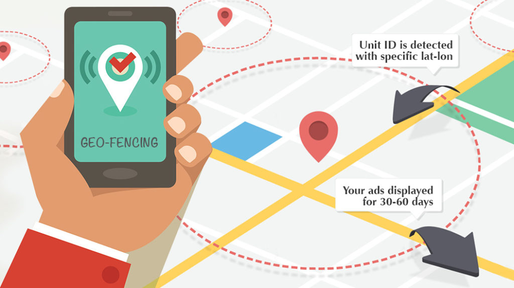

# A Stable GeoFence Library



A flutter project to provide Geo Fence functionality in Android and IOS

## Getting Started

## Getting Started

Android

In your AndroidManifest.xml you should add the following lines:

<uses-permission android:name="android.permission.ACCESS_COARSE_LOCATION" />
<uses-permission android:name="android.permission.ACCESS_FINE_LOCATION" />

```
final geoFenceService = GeoFenceService()
```

## Starting GeoFenceService
```
geoFenceService.startService({
    ///Latitude of the fence center
    fenceCenterLatitude: _fence_latitude,

    ///Longitude of the fence center
    fenceCenterLongitude: _fence_longitude,
    
    ///Radius in meter which indicates how much area will be covered by Fence
    radius: fence_area,
})
```


## Stop GeoFenceService
```
geoFenceService.stopFenceService()
```

## Get User status with respect to Fence
```
Status status = geoFenceService.getStatus()
```

## Get user's current location
```
Position? position = geoFenceService.getCurrentLocation()
```

## Listen change for Enter and Exit status for the fence
```
geoFenceService.geoFenceStatusListener.listen((geoFenceStatus) => {
    ///here geoFenceStatus will be listened whenever user enters or exit
})
```

### Important: As the geoFenceStatusListener is a stream so do not forgot to cancel it when the widget gets dispose().

Note: This library doesn't work when the app is in the background.

Reference: This library uses [GeoLocator](https://pub.dev/packages/geolocator) internally

